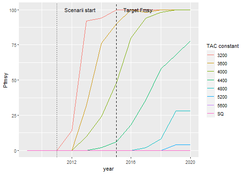

```r
# Dépendances pour l'analyse des données et les représentations graphiques.
library(magrittr)
library(ggplot2)
library(dplyr)
library(IAM)
library(parallel)
library(beepr)
```

Le modèle bio-économique IAM a été développé notamment pour permettre d'accompagner le développement des plans de gestion des pêcheries et d'explorer les conséquences biologiques et socio-économiques de différents scénarios de TAC et quotas et de transition vers le Rendement Maximum Durable - RMD (ou Maximum Sustainable Yield - MSY).

Ce document présente la mise en œuvre avec le modèle IAM de scénarios de TAC et quotas correspondant à différents chemins de transition vers le $F_{msy}$ (différentes valeurs de TAC constants permettant l'atteinte du FMSY plus ou moins rapidement).

L'ensemble des simulations présentées dans l'exemple sera réalisé avec le jeu de donnée example `Ifremer` composé de 7 flottilles et 3 espèces dynamiques dont une espèce à dynamique SS3. Les simulations prennent en compte la variabilité du recrutement et ses conséquences en termes de probabilité d'atteinte du FMSY. Dans ce cadre, une réplication de valeur N sera réalisée à partir du jeu de donnée exemple.

**Attention ce document lance de nombreuses simulations $(1 + n_{TAC})\cdot N$ et prend donc un temps long à simuler (plusieurs dizaines de minutes).**


```r
data("IAM_input_2009")
summary(IAM_input_2009)
#> My Input (IAM input) :
#> Simulation of 3 dynamic species, 19 static species and 7 fleet
#> Simulation start in 2009 and end in 2020 (12 steps)
#> 
#> ------------------------------------
#> Dynamic Species | Model |     Ages |
#>             ARC |   XSA | 0 to +gp |
#>             COR |   XSA | 2 to +gp |
#>             DAR |   SS3 | 0 to +gp |
#> ------------------------------------
#>                   Fleet |    nbv   |
#>                    Alis |    24    |
#>                   Antea |    36    |
#>                Atalante |    15    |
#>                Haliotis |     5    |
#>         Marion_Dufresne |     9    |
#>            Pourquoi_pas |    18    |
#>                Thalassa |    60    |
```

L'objet argument est laissé tel quel lors de l'utilisation de l'interface et sera édité à la main plus tard pour chaque scénario.


```r
# Cette ligne ouvre une interface via une app shiny.
IAM_argum_2009 <- IAM.args(IAM_input_2009)
```

Cela revient à initialiser un objet de classe `iamArgs` sans passer par l'interface avec la commande suivante :


```r
IAM_argum_2009 <- IAM.input2args(IAM_input_2009)
```

## Scénario *statu quo*

Afin de pouvoir comparer l'effet de chaque scénario, il nous faut un scénario de départ dans lequel les mesures de Gestion ne s'imposeront pas.

Dans un premier temps, les dynamiques de recrutements ainsi que des éléments de paramétrage du module économique sont définies. On va pour cela éditer l'objet `IAM_argum_2009`.


```r
# Module SR
# Add noise to COR recruitment
IAM_argum_2009@arguments$Recruitment$COR$wnNOISEmodSR <- 0.203
IAM_argum_2009@arguments$Recruitment$COR$noiseTypeSR <- 2 # Log-normal
IAM_argum_2009@arguments$Recruitment$COR$typeMODsr <- "Hockey-Stick"
IAM_argum_2009@arguments$Recruitment$COR$parAmodSR <- 2539.5
IAM_argum_2009@arguments$Recruitment$COR$parBmodSR <- 9679

# Module EcoDCF
IAM_argum_2009 <- IAM.editArgs_Eco(IAM_argum_2009, dr = 0.04, perscCalc = 1)

# Module Gestion
mfm <- with(IAM_input_2009@input$Fleet,{
  (effort1_f_m * effort2_f_m * nbv_f_m) / as.vector(effort1_f * effort2_f * nbv_f)
})
mfm[is.na(mfm)] <- 0

IAM_argum_2009 <- IAM.editArgs_Gest(IAM_argum_2009, active = FALSE,
                                    delay = 1, mfm = mfm)

# Module Scenario
IAM_argum_2009 <- IAM.editArgs_Scenar(IAM_argum_2009) # desactivate scenario

summary(IAM_argum_2009)
#> My Input (IAM argument) :
#> Simulation of 3 dynamic species, 19 static species and 7 fleet
#> Simulation start in 2009 and end in 2020 (12 steps)
#> 
#> =======================================================================================
#>   SR module  |               Stock Recruitment             |      Noise       | Proba |
#> ---------------------------------------------------------------------------------------
#>     Species  |    function  :  param A ; param B ; param C |  Type :    sd    |  Type |
#>    ARC (XSA) |          Mean 3.641e+07  0.00e+00  0.00e+00 |  Norm | 0.00e+00 |   .   |
#>    COR (XSA) |  Hockey-Stick 2.540e+03  9.68e+03  0.00e+00 |  LogN | 2.03e-01 |   .   |
#>    DAR (SS3) | not activated 0.000e+00  0.00e+00  0.00e+00 |  Norm | 0.00e+00 |   .   |
#> ---------------------------------------------------------------------------------------
#> 
#>  The Gestion module is not active.
#> 
#> ============================================================
#> Economic : PerscCalc = 1 ; dr = 0.040 | No replicates      |
#> ------------------------------------------------------------
#> 
#>  The Scenario module is not active.
```


## Selection des différents TACs.

La recherche du TAC pour atteindre le $F_{msy}$ se fait en simulant plusieurs scénarios correspondant à différentes valeurs de TACs simulées.

Les scénarios sont simulés avec $N$ réplicats, correspondant à la variabilité du recrutement.

Les valeurs de $N$, $F_{msy}$ et $TAC$ sont fixées ici :


```r
N <- 500
Fmsy <- 0.26
TACS <- seq(3200, 5600, by = 400)
```

3500 simulations seront donc effectuées. La simulation du scénario Statu Quo est codée comme suit :


```r
# Statu quo
SQ <- replicate(N, {
  IAM::IAM.model(objArgs = IAM_argum_2009,  objInput = IAM_input_2009)
})

SQl <- lapply(1:N,  function(y) {
  IAM.format(SQ[[y]], name = c("Fbar", "SSB", "L_et"),
             sim_name = "SQ", n = y)
})
SQ <- do.call(rbind, SQl)
```

Afin de simplifier le code, seules les variables biologiques seront extraites et représentées. Pour cela, la fonction suivante est utilisée :


```r
#' Function for simulation under TAC
#' @param x TAC value
#' @param argum iamArgs object
#' @param input iamInput object
#' @param N Number of replicates
#'
#' @return formated table of class iam_formtbl that regroup values
#' for N simulation under a scenario. Only Fbar, SSB and L_et
#' variables are extracted.
simultac <- function(x, argum, input, N){

  argum_int <- IAM.editArgs_Gest(argum, type = "x", active = TRUE,
                             tac = c(NA, NA, rep(x, 10)) )

  sim <- replicate(N, {
  IAM::IAM.model(objArgs = argum_int,  objInput = input)
  })

  siml <- lapply(1:N,  function(y) {
    IAM.format(sim[[y]], name = c("Fbar", "SSB", "L_et"),
               sim_name = as.character(x), n = y)
  })
  sim <- do.call(rbind, siml)

  return(sim)
}
```

De même, des modifications du paramètrage sur le module Gestion ont lieu en commun pour tout les scénarios suivants. Ces modifications sont regroupées ici avec la selection de la variables d'ajustement (`Nb trips`), la cible (`TAC`), l'espèce concernées (`COR`), un délais avant l'application de la mesure de gestion (2 ans) et comment s'applique la modulation de l'effort (multiplicatif borné entre 1e6 et -100)


```r
IAM_argum_2009_TAC <- IAM.editArgs_Gest(
  IAM_argum_2009, active = FALSE, control = "Nb trips", target = "TAC",
  espece = "COR", delay = 2,
  type = "x", bounds = c(1e6, -100),
  tac = c(NA, NA, rep(3600, 10)))
      #   09, 10,     2011:2020

TACS # TACS values to remember
#> [1] 3200 3600 4000 4400 4800 5200 5600
# Warning ! Code run for long time.
x <- Sys.time()
cl <- makeCluster(detectCores()-1)
invisible(clusterEvalQ(cl,library(IAM)))

res <-parLapply(cl, as.list(TACS), simultac,
                 IAM_argum_2009_TAC, IAM_input_2009, N)
stopCluster(cl)

res <- do.call(rbind, c(res, list(SQ)))
print(Sys.time() - x)
#> Time difference of 35.0032 mins
```


### Représentations graphiques

On peut aisement comparer les différents scénarios en utilisant les fonctions graphiques.
<!-- Ainsi, on observe que nos scénarios de TAC arrivent tout deux à la reconstruction progressive du stock "COR" par une baisse de la mortalité par pêche (Fbar). -->


```r
COR <- res %>%
  filter(species == "COR") %>%
  IAM.format_quant(., probs = c(.025, .975))

COR %>%
  ggplot(aes(x = year, y = median)) +
  facet_grid(variable ~ sim_name, scales = "free_y") +
  geom_ribbon(aes(ymin = quant1, ymax = quant2), fill = "lightblue") +
  geom_line() +
  geom_line(aes(y = value), linetype = "dotted") +
  geom_vline(xintercept=2011, linetype = "dotted") +
  IAM_theme() +
  NULL
```


```r
line_data <- data.frame(xintercept = c(2011, 2015),
                        Lines = c("Scenarii start", "Target Fmsy"),
                        linetype = c("dotted", "dashed"),
                        stringsAsFactors = FALSE)

Proba <- res %>%
  filter(species == "COR") %>%
  group_by(.data$sim_name, .data$variable, .data$year) %>%
    summarize(Pfmsy = sum(.data$value <= Fmsy) / length(unique(n)) * 100,
              .groups = "keep") %>% ungroup()

Proba %>%
  filter(variable == "Fbar") %>%
  ggplot(aes(x = year, y = Pfmsy, color = as.factor(sim_name)))+
  geom_line() +
  geom_vline(xintercept= line_data$xintercept, linetype = line_data$linetype) +
  annotate("text", line_data$xintercept, 100, hjust = -.25,
    label = line_data$Lines) +
  scale_colour_discrete(name  ="TAC constant") +
  NULL
```


```r
filter(Proba, year == 2015, variable == "Fbar")
#> # A tibble: 8 x 4
#>   sim_name variable  year Pfmsy
#>   <chr>    <chr>    <dbl> <dbl>
#> 1 3200     Fbar      2015  76.4
#> 2 3600     Fbar      2015  85.6
#> 3 4000     Fbar      2015  60.6
#> 4 4400     Fbar      2015  13  
#> 5 4800     Fbar      2015   0.6
#> 6 5200     Fbar      2015   0  
#> 7 5600     Fbar      2015   0  
#> 8 SQ       Fbar      2015   0
beepr::beep(3)
```

## TAC jusqu'au Fmsy.

On reproduit l'analyse précédente mais en changeant la cible des scénarios. Ainsi, on va ici viser un TAC jusqu'à atteinte d'un Fbar. On précise pour cela un $Fbar$ cible et on réduit les bornes de recherche du multiplicateur $\mu$.


```r
IAM_argum_2009_TAC_fmsy <- IAM.editArgs_Gest(
  IAM_argum_2009_TAC, active = FALSE, target = "TAC->Fbar",
  type = "x", bounds = c(100, -100),
  tac = c(NA, NA, rep(3600, 10)),
  fbar = c(NA, NA, rep(Fmsy, 10)))
      #   09, 10,      2011:2020

TACS # TACS values to remember
#> [1] 3200 3600 4000 4400 4800 5200 5600
# Warning ! Code run for long time.
x <- Sys.time()
cl <- makeCluster(detectCores()-1)
invisible(clusterEvalQ(cl,library(IAM)))

res <-parLapply(cl, as.list(TACS), simultac,
                IAM_argum_2009_TAC_fmsy, IAM_input_2009, N)
stopCluster(cl)

res <- do.call(rbind, c(res, list(SQ)))
print(Sys.time() - x) # 50 -> 3 min
#> Time difference of 40.88487 mins
```


### Représentations graphiques

Les représentations graphiques reprennent le même code que précédement.


```r
COR <- res %>%
  filter(species == "COR") %>%
  IAM.format_quant(., probs = c(.025, .975))

COR %>%
  ggplot(aes(x = year, y = median)) +
  facet_grid(variable ~ sim_name, scales = "free_y") +
  geom_ribbon(aes(ymin = quant1, ymax = quant2), fill = "lightblue") +
  geom_line() + geom_point(size = .5) +
  geom_line(aes(y = value), linetype = "dotted") +
  geom_vline(xintercept=2011, linetype = "dotted") +
  IAM_theme() +
  NULL
```


### Calcul de la probabilité d'atteindre le $F_{msy}$

On peut calculer la probabilité d'atteindre le $F_{msy}$ comme le pourcentage de simulation ayant un $F_{bar} < F_{msy}$.


```r
line_data <- data.frame(xintercept = c(2011, 2015),
                        Lines = c("Scenarii start", "Target Fmsy"),
                        linetype = c("dotted", "dashed"),
                        stringsAsFactors = FALSE)

Proba <- res %>%
  filter(species == "COR") %>%
  group_by(.data$sim_name, .data$variable, .data$year) %>%
    summarize(Pfmsy = sum(.data$value <= Fmsy) / length(unique(n)) * 100,
              .groups = "keep") %>% ungroup()

Proba %>%
  filter(variable == "Fbar") %>%
  ggplot(aes(x = year, y = Pfmsy, color = as.factor(sim_name)))+
  geom_line() +
  geom_vline(xintercept= line_data$xintercept, linetype = line_data$linetype) +
  annotate("text", line_data$xintercept, 100, hjust = -.25,
    label = line_data$Lines) +
  scale_colour_discrete(name  ="TAC constant") +
  NULL
```



```r
filter(Proba, year == 2015, variable == "Fbar")
#> # A tibble: 8 x 4
#>   sim_name variable  year Pfmsy
#>   <chr>    <chr>    <dbl> <dbl>
#> 1 3200     Fbar      2015  74.6
#> 2 3600     Fbar      2015  81.6
#> 3 4000     Fbar      2015  58.2
#> 4 4400     Fbar      2015  12.4
#> 5 4800     Fbar      2015   0  
#> 6 5200     Fbar      2015   0  
#> 7 5600     Fbar      2015   0  
#> 8 SQ       Fbar      2015   0
beepr::beep(3)
```


